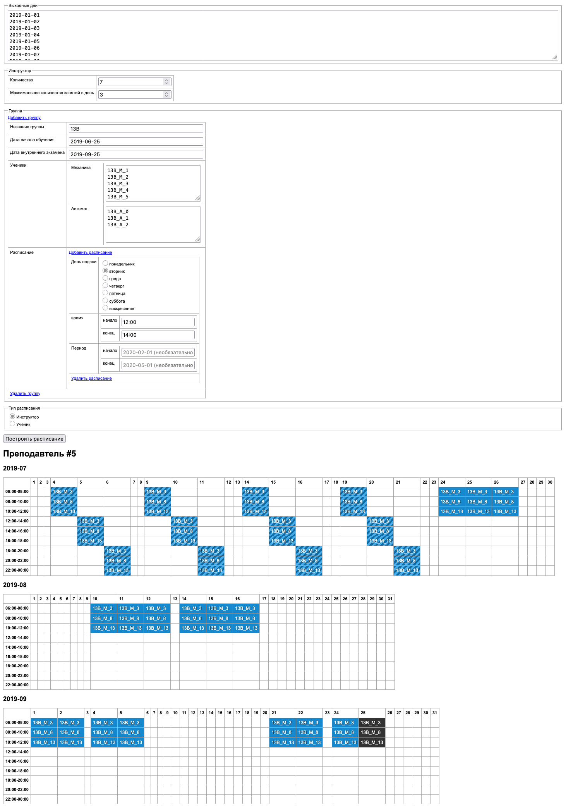

# Планировщик занятий автошколы

- Homepage: [проекты.md.land / планировщик занятий автошколы](https://проекты.md.land/планировщик-занятий-автошколы)
- Live demo: [проекты.md.land / планировщик занятий автошколы / live](https://проекты.md.land/планировщик-занятий-автошколы/live)

<details>
  <summary>Простой пример</summary>



</details>

[Сложный пример](docs/_static/app.ui.advanced.png) 

---

Система планирования расписания практических занятий автошколы 
с учётом требований ГИБДД, Рособрнадзор, Роспотребнадзор РФ.

- начало практических занятий на площадке через неделю после первого 
  теоритического занятия группы
- 11 занятий для ученика программы (автомат), 12 — программы (механика)    
- не более трёх занятий в день для одного инструктора
- планирование последнего занятия в городе для учеников одной группы 
  на день внутреннего экзамена группы
- распределение занятий ученика на период обучения группы
  - равномерное распределение занятий учеников группы
  - равномерное распределение занятий учеников разных групп
  

- чередовать две группы по занятиям на площадке
  - для каждой группы нужно указывать такой день
- для одного инструктора не больше 6 человек из одной группы
- нужно учитывать что если в день занятий - площадка,
  то череда занятий (площадка / город / площадка) может быть невозможной
- выполнить проверку что дата экзамена не выпадает на праздники

## Roadmap

- реализовать перерыв между занятиями на площадке в 15 минут
- отказаться от конфигурации количества инструкторов в пользу конфигурации
  их списка 
  - закреплять определённых учеников за определёнными инструкторами
- решить проблему конфликта требования для ситуации
  когда невозможно запланировать последнее занятии группы 
  или из-за большого количества учеников или за требования 
  максимального количества занятий инструктора в день
  
- упростить реализацию: `DateTimeInterval` 

[//]: # (## [История проекта]&#40;#&#41;)

## Design

- [POC](https://ru.wikipedia.org/wiki/Проверка_концепции)
- SOLID
- SPA

### Stack

- python 3.6 / bottle / uwsgi 
- html / js / css

## Usage

Docker way:

```sh
HTTP_PORT=8001 docker compose up
# open http://localhost:8001
```

---

Native way:

```sh
pip install -r requirements.txt
```

<details>
  <summary>nginx & uwsgi install</summary>

```sh
# example for macos:
brew install nginx uwsgi
```

</details>

<details>
  <summary>nginx configuration example</summary>

```
upstream uwsgi_app {
  server unix:/usr/local/run/uwsgi/app.sock;
}

server {
  listen       8100;
  server_name  localhost;

  location / {
    root   "./src/public";
    index  index.html;
  }

  location /api/ {
    try_files $uri @uwsgi;
  }

  location @uwsgi {
    include uwsgi_params;
    uwsgi_pass uwsgi_app;
  }
}
```

</details>


<details>
  <summary>uWSGI</summary>

```ini
[uwsgi]
socket = /usr/local/run/uwsgi/app.sock
chdir = .../src/sbin
pythonpath = .../src/lib
master = true
plugins = python3
file = api.py
callable = app
manage-script-name = true
```

</details>

Run:

```sh
uwsgi --ini /usr/local/etc/uwsgi/app.ini
nginx
```

## License

WTFPL ?
